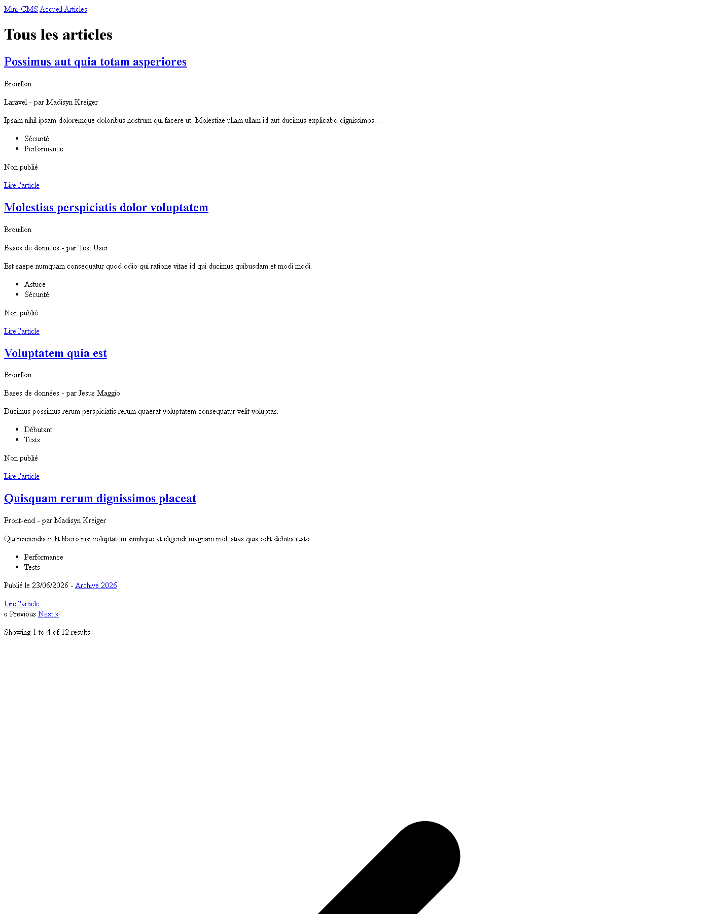
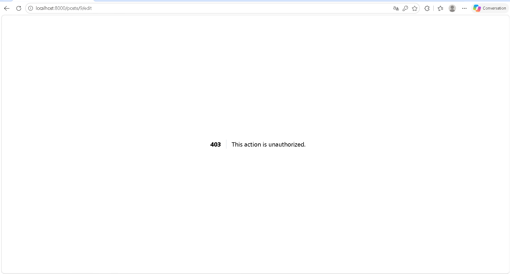

## État actuel (tag lab-06)

- Comptes écrits à la main : inscription (`/inscription`), connexion (`/connexion`) et déconnexion, avec `Hash::make`, `Auth::attempt` et la régénération de la session.
- Colonne `role` (`author` par défaut, `admin`). Après `php artisan migrate:fresh --seed`, le compte de démonstration `test@example.com` (mot de passe `password`) est administrateur.
- Écritures et back-office réservés aux utilisateurs connectés (middleware `auth`) ; chaque nouvel article est attaché à son auteur.
- Gate `manage-categories` : seuls les administrateurs gèrent les catégories.
- `PostPolicy` : un auteur modifie et supprime ses articles, un administrateur tous les articles.
- Page « Mes articles » (`/mes-articles`) et case « Se souvenir de moi » sur la connexion.
- Tests Pest : `PostPagesTest`, `PostWriteTest`, `PostRelationsTest`, `PostTaxonomyTest`, `PostFeedbackTest`, `CategoryAdminTest`, `ErrorPagesTest`, `AuthTest` et `AuthorizationTest`.

## Routes disponibles

| Méthode | URI | Nom | Action |
|---|---|---|---|
| GET | `/` | `home` | `PageController@home` |
| GET | `/a-propos` | `about` | `PageController@about` |
| GET | `/heure` | `time` | `PageController@time` |
| GET | `/posts` | `posts.index` | `PostController@index` |
| GET | `/posts/archive/{year}` | `posts.archive` | `PostController@archive` |
| GET | `/posts/categorie/{category:slug}` | `posts.category` | `PostController@byCategory` |
| GET | `/posts/tag/{tag:slug}` | `posts.tag` | `PostController@byTag` |
| GET | `/posts/create` | `posts.create` | `PostController@create` |
| POST | `/posts` | `posts.store` | `PostController@store` |
| GET | `/posts/{post}` | `posts.show` | `PostController@show` |
| GET | `/posts/{post}/edit` | `posts.edit` | `PostController@edit` |
| PUT | `/posts/{post}` | `posts.update` | `PostController@update` |
| DELETE | `/posts/{post}` | `posts.destroy` | `PostController@destroy` |
| PATCH | `/posts/{post}/publication` | `posts.publication` | `PostController@togglePublication` |
| GET | `/admin/categories` | `admin.categories.index` | `CategoryController@index` |
| GET | `/admin/categories/create` | `admin.categories.create` | `CategoryController@create` |
| POST | `/admin/categories` | `admin.categories.store` | `CategoryController@store` |
| GET | `/admin/categories/{category}/edit` | `admin.categories.edit` | `CategoryController@edit` |
| PUT | `/admin/categories/{category}` | `admin.categories.update` | `CategoryController@update` |
| DELETE | `/admin/categories/{category}` | `admin.categories.destroy` | `CategoryController@destroy` |
| GET | `/admin/tags` | `admin.tags.index` | `TagController@index` |
| GET | `/admin/tags/create` | `admin.tags.create` | `TagController@create` |
| POST | `/admin/tags` | `admin.tags.store` | `TagController@store` |
| GET | `/admin/tags/{tag}/edit` | `admin.tags.edit` | `TagController@edit` |
| PUT | `/admin/tags/{tag}` | `admin.tags.update` | `TagController@update` |
| DELETE | `/admin/tags/{tag}` | `admin.tags.destroy` | `TagController@destroy` |
| GET | `/inscription` | `register` | `Auth\RegisterController@create` |
| POST | `/inscription` | `register.store` | `Auth\RegisterController@store` |
| GET | `/connexion` | `login` | `Auth\LoginController@create` |
| POST | `/connexion` | `login.store` | `Auth\LoginController@store` |
| POST | `/deconnexion` | `logout` | `Auth\LoginController@destroy` |
| GET | `/mes-articles` | `my-posts` | `PostController@myPosts` |
### Session 06

### Session 07

### Session 08

### Session 09

### Session 10

Back-office des catégories et des tags, messages de validation en français, pages 404 et 503 dans le layout du site.

### Session 11

